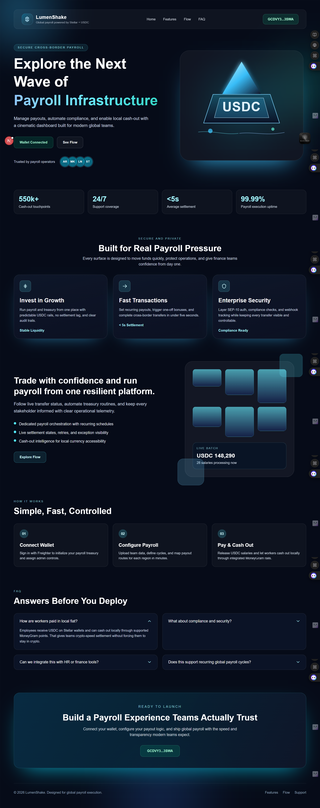
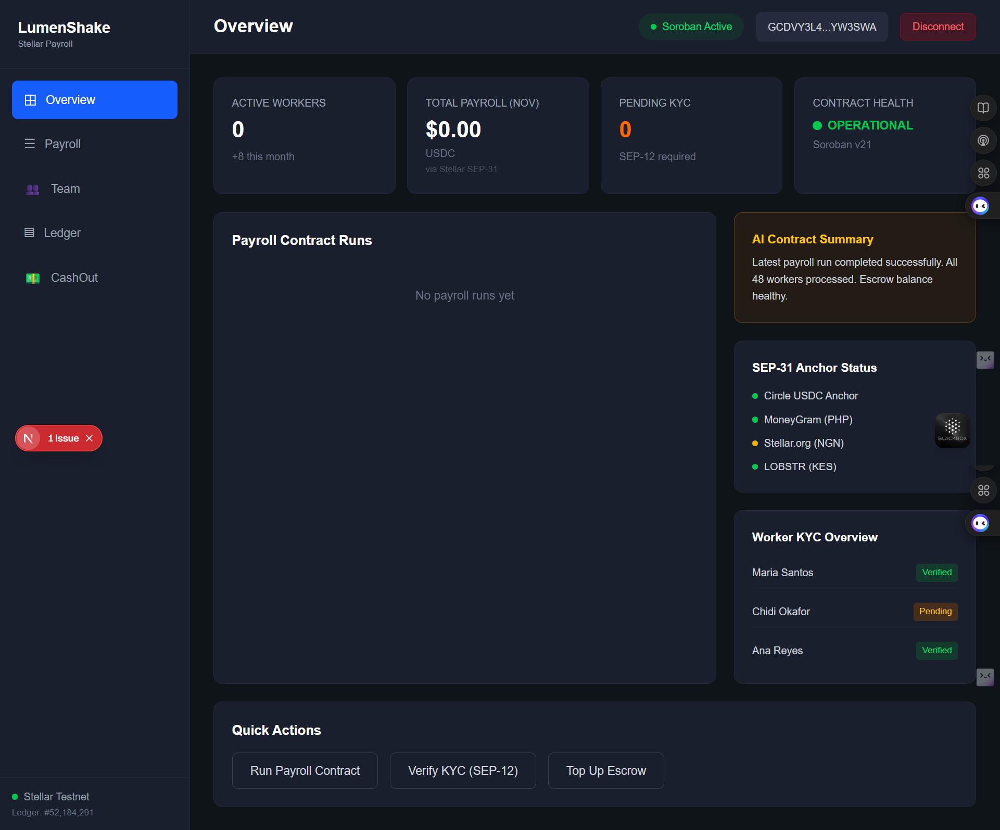
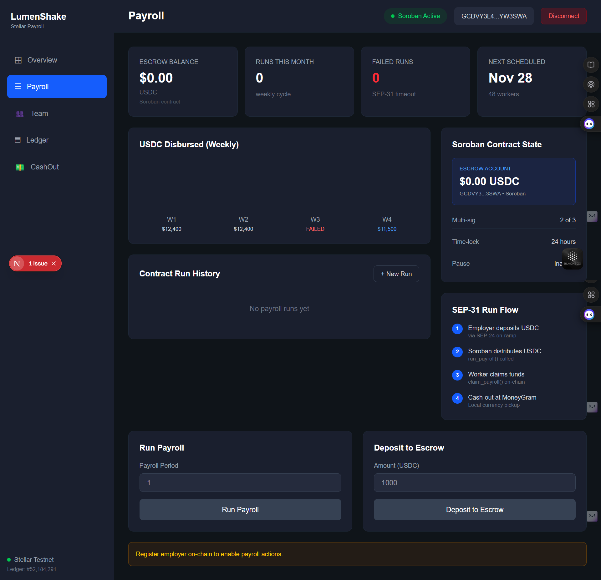
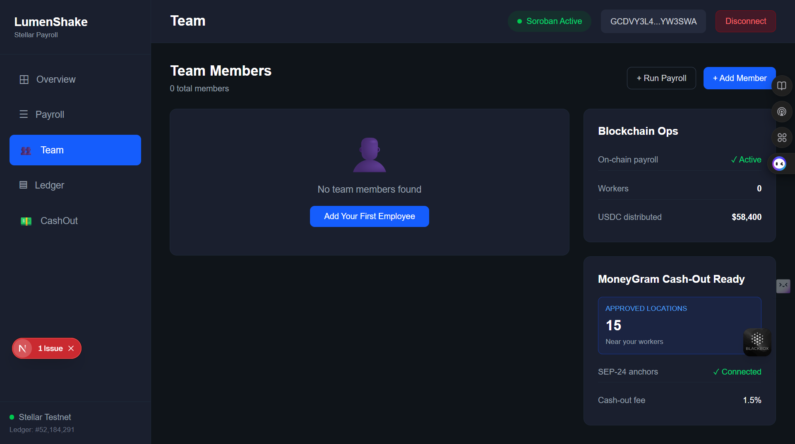
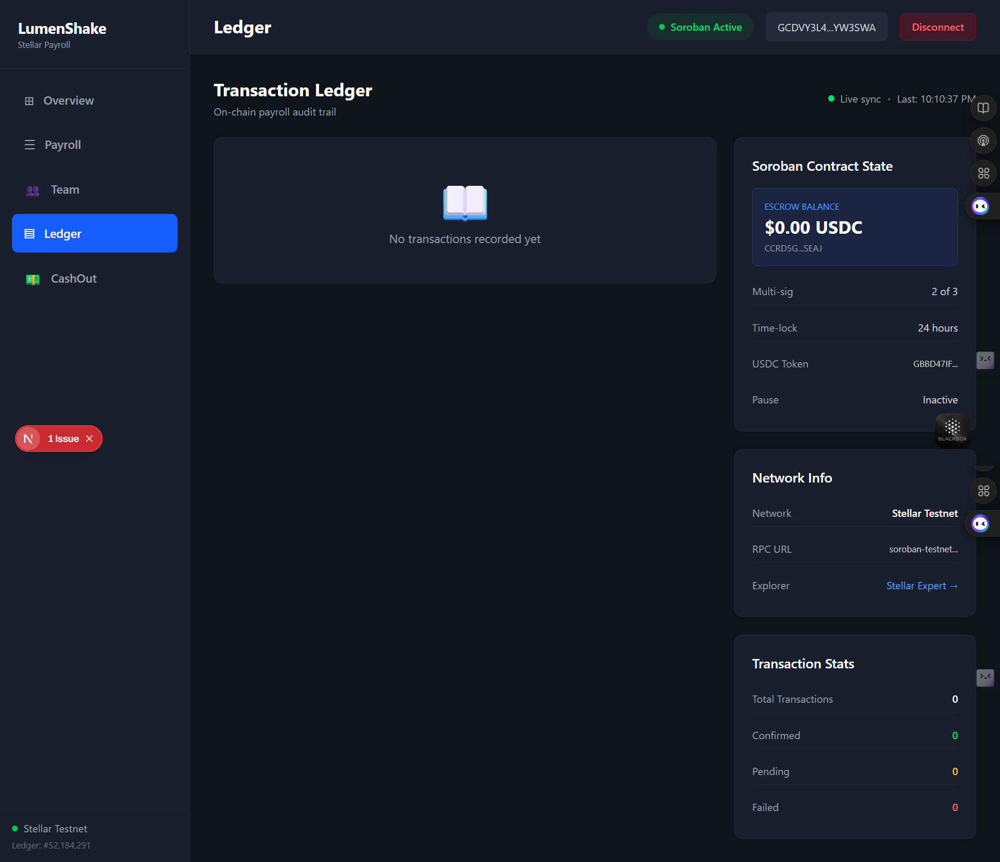
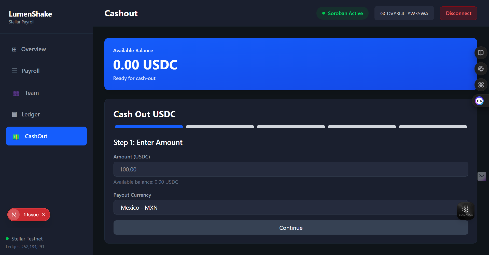

<div align="center">

# 🌟 LumenShake

**Global Payroll Infrastructure on Stellar Network**

[](#)
[](https://stellar.expert/explorer/testnet)
[](https://soroban.stellar.org)
[](LICENSE)

[](https://nodejs.org)
[](https://postgresql.org)
[](https://soroban.stellar.org)
[](https://nextjs.org)


[](docs/TASKS_9_10_COMPLETE.md)
[](docs/TASK11_MONITORING_COMPLETE.md)
[](docs/TECHNICAL_DOCUMENTATION.md)
[](https://github.com/janvi100104/LumenShake/commits/main)
[](https://github.com/janvi100104/LumenShake/actions/workflows/CI.yaml)

---

**Cross-border USDC payroll • SEP compliance • Local fiat cash-out • Real-time monitoring**

</div>

---

## 📋 Quick Links

<div align="center">

| 🎯 Item | 🔗 Link / Status |
|---------|-----------------|
| 📜 **Smart Contract** | [`CCRD5GASTD5IQQPX2ELACIYQRTHQDPWMPFG7AWNWVRP5F6CRT2L3SEAJ`](https://stellar.expert/explorer/testnet/contract/CCRD5GASTD5IQQPX2ELACIYQRTHQDPWMPFG7AWNWVRP5F6CRT2L3SEAJ) |
| 🌐 **Live Demo** | 🚧 Deploying to Vercel • Local: https://lumenshake.vercel.app/ |
| 👛 **35 Wallet Addresses** | [View Below](#-verifiable-wallet-addresses) • All Verifiable on Stellar Explorer |
| 📊 **Metrics API** | `GET /api/metrics/dashboard` (auth required) |
| 📈 **Monitoring** | Prometheus: http://localhost:9090 • Grafana: http://localhost:3001 |
| 🔁 **CI/CD Pipeline** | [Workflow](.github/workflows/CI.yaml) • [Setup Guide](CI_CD_SETUP.md) |
| 🖼️ **Demo Screenshots** | [UI Gallery + Twitter Post](#-demo-ui-gallery) |
| 📝 **Feedback Form** | [Google Form](https://forms.gle/Jgji7Pe1AiTKJXEi6) |
| 📊 **Feedback Data** | [Google Sheet](https://docs.google.com/spreadsheets/d/1PsHztWKXBd4vVPzIIuzmMXyfw2eG8goRqEGx3QfPeAw/edit?resourcekey#gid=1715253295) • [Excel Export](https://docs.google.com/spreadsheets/d/1PsHztWKXBd4vVPzIIuzmMXyfw2eG8goRqEGx3QfPeAw/export?format=xlsx) |

</div>

---

## 🔁 CI/CD Pipeline

LumenShake includes a production-oriented GitHub Actions pipeline.

- **Workflow file:** `.github/workflows/CI.yaml`
- **CI triggers:** Pull requests to `main`, pushes to `main`, and manual dispatch
- **Backend CI:** dependency install, migration run, and API smoke checks
- **Web CI:** lint + production build checks
- **Contracts CI:** Rust `cargo test` on both smart contracts
- **CD:** on `main` push, backend Docker image is published to GHCR

**Setup & branch protection checklist:** [CI_CD_SETUP.md](CI_CD_SETUP.md)

---

## 🖼️ Demo UI Gallery

| Landing Page | Overview |
|---|---|
|  |  |
| Payroll | Team |
|  |  |
| Ledger | CashOut |
|  |  |

### 🐦 Twitter Post


---

## 📝 User Onboarding & Feedback

### Required Fields

The feedback/onboarding form collects:

✅ **Name** • ✅ **Email** • ✅ **Wallet Address** • ✅ **Product Rating** • ✅ **Feedback Comments**

### Feedback Artifacts

| 📋 Form | 📊 Responses |
|---------|-------------|
| [Google Form](https://forms.gle/Jgji7Pe1AiTKJXEi6) | [Google Sheet](https://docs.google.com/spreadsheets/d/1PsHztWKXBd4vVPzIIuzmMXyfw2eG8goRqEGx3QfPeAw/edit?resourcekey#gid=1715253295) |
| - | [Excel Export (XLSX)](https://docs.google.com/spreadsheets/d/1PsHztWKXBd4vVPzIIuzmMXyfw2eG8goRqEGx3QfPeAw/export?format=xlsx) |


---

## 👛 Verifiable Wallet Addresses

**Network:** Stellar Testnet • **Total:** 35 Wallets (30 Employers + 5 Employees)

**Verification:** All addresses verifiable at https://stellar.expert/explorer/testnet/account/{ADDRESS}

<details>
<summary><b>📋 Click to expand wallet list (35 addresses)</b></summary>

<br>

| # | Role | Wallet Address | Explorer |
|---|------|----------------|----------|
| 1 | employer | `GBTQ4UVEBMKDJVCFLLQPXUZHTZEGR2IELEBQXQPEBG22LIGI2FFACZKB` | [View](https://stellar.expert/explorer/testnet/account/GBTQ4UVEBMKDJVCFLLQPXUZHTZEGR2IELEBQXQPEBG22LIGI2FFACZKB) |
| 2 | employer | `GCOXOXNV676RBJ7NKYQPHCRORI22U7X5H7G5VBXSYWEKIJHV5YDEFDL6` | [View](https://stellar.expert/explorer/testnet/account/GCOXOXNV676RBJ7NKYQPHCRORI22U7X5H7G5VBXSYWEKIJHV5YDEFDL6) |
| 3 | employer | `GD3QSMMHZ4VPBILHEPHQSCLTXKNWKGPOFL7H5ER7BBGVURRDLIP7CTOU` | [View](https://stellar.expert/explorer/testnet/account/GD3QSMMHZ4VPBILHEPHQSCLTXKNWKGPOFL7H5ER7BBGVURRDLIP7CTOU) |
| 4 | employer | `GBMJ2P6XWZ57IQWJ72MA5UJZYX2LDIHE2YBLDLSXHH3ODVYZ7QKXP2SK` | [View](https://stellar.expert/explorer/testnet/account/GBMJ2P6XWZ57IQWJ72MA5UJZYX2LDIHE2YBLDLSXHH3ODVYZ7QKXP2SK) |
| 5 | employer | `GDEUNZR7AD7KMO34HJD73ERZMWRAG7V2JDHWRYQAFW36K6G3E5PXUJWN` | [View](https://stellar.expert/explorer/testnet/account/GDEUNZR7AD7KMO34HJD73ERZMWRAG7V2JDHWRYQAFW36K6G3E5PXUJWN) |
| 6 | employer | `GAZUMDA7LNFMJXJUDATYREAIJEPZLVM3IPBTVXEYIR7XFFOE23MMEJF3` | [View](https://stellar.expert/explorer/testnet/account/GAZUMDA7LNFMJXJUDATYREAIJEPZLVM3IPBTVXEYIR7XFFOE23MMEJF3) |
| 7 | employer | `GC6YIXJQDB5RZSXHKZL5VWJL2V5GJX2QXN5BRWOYSV4M24XJMTYDXPJX` | [View](https://stellar.expert/explorer/testnet/account/GC6YIXJQDB5RZSXHKZL5VWJL2V5GJX2QXN5BRWOYSV4M24XJMTYDXPJX) |
| 8 | employer | `GAODUR2PU4PPJKOXZEK6XGSCBPD5TXQEFNRP25CGEFBM62GES4NBEGKY` | [View](https://stellar.expert/explorer/testnet/account/GAODUR2PU4PPJKOXZEK6XGSCBPD5TXQEFNRP25CGEFBM62GES4NBEGKY) |
| 9 | employer | `GC24ZIPUE6CYNCRKBR3VAMKVC3XX6W2PXQCPQ6JST4PC3MCH2LSC7R6I` | [View](https://stellar.expert/explorer/testnet/account/GC24ZIPUE6CYNCRKBR3VAMKVC3XX6W2PXQCPQ6JST4PC3MCH2LSC7R6I) |
| 10 | employer | `GBJWCRCUKMP4KYZDRIUODFSL7P5CUBPAEBIRALPENVDS6GTNWDMAHAZD` | [View](https://stellar.expert/explorer/testnet/account/GBJWCRCUKMP4KYZDRIUODFSL7P5CUBPAEBIRALPENVDS6GTNWDMAHAZD) |
| 11 | employer | `GADXI6S5IPWHTOZMKSHCOBHONPFMND33Z5FGEY3MD2EVED2YJFJ5VAGV` | [View](https://stellar.expert/explorer/testnet/account/GADXI6S5IPWHTOZMKSHCOBHONPFMND33Z5FGEY3MD2EVED2YJFJ5VAGV) |
| 12 | employer | `GBOXLDJ4SIOY3EVZT2WBD6VRMNS35YYJWBISO3W4HNKRES7PY3QBFCQ7` | [View](https://stellar.expert/explorer/testnet/account/GBOXLDJ4SIOY3EVZT2WBD6VRMNS35YYJWBISO3W4HNKRES7PY3QBFCQ7) |
| 13 | employer | `GCGSFT6NFDRL24QY6EINMLMCL6YQHPZZBMNBSIEV2EYVFGILJBOXNJDZ` | [View](https://stellar.expert/explorer/testnet/account/GCGSFT6NFDRL24QY6EINMLMCL6YQHPZZBMNBSIEV2EYVFGILJBOXNJDZ) |
| 14 | employer | `GAIM73XH27DFGS43JWA5EXNDKGREK5TY6ZW7GXXPPMYTBPVAY6AKR6PO` | [View](https://stellar.expert/explorer/testnet/account/GAIM73XH27DFGS43JWA5EXNDKGREK5TY6ZW7GXXPPMYTBPVAY6AKR6PO) |
| 15 | employer | `GC36DZX6MG5OL4W4L27GMEDVBVTNNJ2DKRAII3X7V4UPMHNAMC46O7LX` | [View](https://stellar.expert/explorer/testnet/account/GC36DZX6MG5OL4W4L27GMEDVBVTNNJ2DKRAII3X7V4UPMHNAMC46O7LX) |
| 16 | employer | `GC4Q66VBLDDYMPMJ6NIZEBL5XTVVQBAEBXR5CQWM2S6GF4ALZUXDV5GO` | [View](https://stellar.expert/explorer/testnet/account/GC4Q66VBLDDYMPMJ6NIZEBL5XTVVQBAEBXR5CQWM2S6GF4ALZUXDV5GO) |
| 17 | employer | `GD3A2WCYSF5FZFOAZNRZF5H52CTGA5ZNIJFHRRARFSX7NGU4YY6BACT6` | [View](https://stellar.expert/explorer/testnet/account/GD3A2WCYSF5FZFOAZNRZF5H52CTGA5ZNIJFHRRARFSX7NGU4YY6BACT6) |
| 18 | employer | `GAYYAZM2FZ3Q5B46MOURR4LCA5OZDGPNNOK66ETFTFDGJCHFXGLPH72R` | [View](https://stellar.expert/explorer/testnet/account/GAYYAZM2FZ3Q5B46MOURR4LCA5OZDGPNNOK66ETFTFDGJCHFXGLPH72R) |
| 19 | employer | `GD25SZREHBPNVDEDE6DFSUQINKU7HGZ2LW3SSVZ6NPDWYO7MGHJB2ULS` | [View](https://stellar.expert/explorer/testnet/account/GD25SZREHBPNVDEDE6DFSUQINKU7HGZ2LW3SSVZ6NPDWYO7MGHJB2ULS) |
| 20 | employer | `GCOFIURNH3HD72LVY4UAZGXLF6C7EXHMEKZBT6SD3TEKNJ24ZWDJVCWW` | [View](https://stellar.expert/explorer/testnet/account/GCOFIURNH3HD72LVY4UAZGXLF6C7EXHMEKZBT6SD3TEKNJ24ZWDJVCWW) |
| 21 | employer | `GB3LWDPR7IETLZJNADBWLJSWNLFYTU3HK6WBPONT72JWUIIHA7BMZMQI` | [View](https://stellar.expert/explorer/testnet/account/GB3LWDPR7IETLZJNADBWLJSWNLFYTU3HK6WBPONT72JWUIIHA7BMZMQI) |
| 22 | employer | `GDI6N5ZX7GACMUZKNB5LDYR2P3CUHJJC6C6FNBPN3ZE5VKH5XKKFY6RC` | [View](https://stellar.expert/explorer/testnet/account/GDI6N5ZX7GACMUZKNB5LDYR2P3CUHJJC6C6FNBPN3ZE5VKH5XKKFY6RC) |
| 23 | employer | `GDAQGMSA4HNBDWUBKC6PCEOMVYNWZZ5ZXUQEX5M2QN3HYOPWJF53RIYR` | [View](https://stellar.expert/explorer/testnet/account/GDAQGMSA4HNBDWUBKC6PCEOMVYNWZZ5ZXUQEX5M2QN3HYOPWJF53RIYR) |
| 24 | employer | `GA4MTCRYEXY4UXFKRGTUJPQGAL5UX7K5Z2OKLEF3AKD7DJDCWCGDJ5XR` | [View](https://stellar.expert/explorer/testnet/account/GA4MTCRYEXY4UXFKRGTUJPQGAL5UX7K5Z2OKLEF3AKD7DJDCWCGDJ5XR) |
| 25 | employer | `GBBVDLDLMZOSRMSUVOK5JSJO7FRPQGSPLQWUPNGEQFNZNF4DVAN5WHBW` | [View](https://stellar.expert/explorer/testnet/account/GBBVDLDLMZOSRMSUVOK5JSJO7FRPQGSPLQWUPNGEQFNZNF4DVAN5WHBW) |
| 26 | employer | `GBGB3HUQGAFWXC25BMAA5EJHX5ARIY7VS2PPQGS2XHWBKAGPGSLMOCJJ` | [View](https://stellar.expert/explorer/testnet/account/GBGB3HUQGAFWXC25BMAA5EJHX5ARIY7VS2PPQGS2XHWBKAGPGSLMOCJJ) |
| 27 | employer | `GCV6S2HYDW2DW7OOOTBOXRUAARGSUD62QCXQRW634DIFVDUBJIPEYEDD` | [View](https://stellar.expert/explorer/testnet/account/GCV6S2HYDW2DW7OOOTBOXRUAARGSUD62QCXQRW634DIFVDUBJIPEYEDD) |
| 28 | employer | `GAPB6DRCXCDJFZKDQOHMX7CPAG66LMFX2U3GHEFHFPYFD3U6RKWS7L7S` | [View](https://stellar.expert/explorer/testnet/account/GAPB6DRCXCDJFZKDQOHMX7CPAG66LMFX2U3GHEFHFPYFD3U6RKWS7L7S) |
| 29 | employer | `GDCJI6YTJR3TUCU6I7AMTHDHEIJFD6JQCME3OP4LIJ5AAC5UJVIZHLEK` | [View](https://stellar.expert/explorer/testnet/account/GDCJI6YTJR3TUCU6I7AMTHDHEIJFD6JQCME3OP4LIJ5AAC5UJVIZHLEK) |
| 30 | employer | `GB3LVW6R75AJL2L2UNAPL7ADJPPHLYEG3Y6ST43IA6BQOBS65C4DZYNG` | [View](https://stellar.expert/explorer/testnet/account/GB3LVW6R75AJL2L2UNAPL7ADJPPHLYEG3Y6ST43IA6BQOBS65C4DZYNG) |
| 31 | employee | `GA2AR2NFVEMRCFKUPJ6IA3M4TIZP5FRPRVTNZRR2CWI62LGZZEXO4FBI` | [View](https://stellar.expert/explorer/testnet/account/GA2AR2NFVEMRCFKUPJ6IA3M4TIZP5FRPRVTNZRR2CWI62LGZZEXO4FBI) |
| 32 | employee | `GCA6VETGBQQOQPUEBCYXEFDKBTUBE4XSJH2ZIR3XX3I46AOIIOLR3UQA` | [View](https://stellar.expert/explorer/testnet/account/GCA6VETGBQQOQPUEBCYXEFDKBTUBE4XSJH2ZIR3XX3I46AOIIOLR3UQA) |
| 33 | employee | `GD2FWUBHI4ITSDSP6737PRPA2YZVC6SX6H2NOS5VQX6675EBHJGC2ZDB` | [View](https://stellar.expert/explorer/testnet/account/GD2FWUBHI4ITSDSP6737PRPA2YZVC6SX6H2NOS5VQX6675EBHJGC2ZDB) |
| 34 | employee | `GCV6ZYSNUV2L4QT3D7HDKWWDCTK5NPU3K7EXZ5GGKSQ4HEYQDTJN2ULE` | [View](https://stellar.expert/explorer/testnet/account/GCV6ZYSNUV2L4QT3D7HDKWWDCTK5NPU3K7EXZ5GGKSQ4HEYQDTJN2ULE) |
| 35 | employee | `GBXK4HYAUJRB3PRVG4R2J5VWJMKJDFOV7M3KYLEDOQVWHS7YUZSRU4NT` | [View](https://stellar.expert/explorer/testnet/account/GBXK4HYAUJRB3PRVG4R2J5VWJMKJDFOV7M3KYLEDOQVWHS7YUZSRU4NT) |


</details>

---

## 🚀 Next-Phase Improvement Plan

**Feedback-Driven Roadmap** (Based on user onboarding & product feedback themes)

<div align="center">

| # | Improvement Area | Baseline Commit | Status |
|---|-----------------|-----------------|--------|
| 1 | **Wallet Onboarding UX** - Improve success rate & error clarity | [c68d1c7](https://github.com/janvi100104/Lumenshake/commit/c68d1c7fc87b03915bcdba6f5308ca0f95aa9f33) | 🔄 In Progress |
| 2 | **Payroll Observability** - Strengthen transaction sync guarantees | [b8dc1a5](https://github.com/janvi100104/Lumenshake/commit/b8dc1a5ed369d1396aed816b58b5a23a08eb386d) | 🔄 In Progress |
| 3 | **Payroll Tab UX** - Enhance API integration resilience | [4d82465](https://github.com/janvi100104/Lumenshake/commit/4d82465f03e9ec7d903b0d6e7268dad83491a0da) | 🔄 In Progress |
| 4 | **Documentation Quality** - Expand onboarding clarity | [23f1369](https://github.com/janvi100104/Lumenshake/commit/23f1369eb4a5d305e52b7c26e4a62e5302ae708b) | ✅ Complete |
| 5 | **Feedback Loop** - Continuous improvements | [c74ccc3](https://github.com/janvi100104/Lumenshake/commit/c74ccc3f907ba19855f893ba4dda8fee83a94db4) | 🔄 Ongoing |

</div>

---

## 🌍 Advanced Feature Deep Dive

### Cross-Border Flows (SEP-24 + SEP-31 Anchor Rails)

LumenShake implements **cross-border payment rails** as the required advanced feature, combining:

- **SEP-24** interactive deposit/withdrawal transaction lifecycle
- **SEP-31** send/receive cross-border transfer workflow
- **Webhook event delivery** for lifecycle updates and integrations
- **KYC-aware processing** through SEP-12 customer data and validation paths

#### End-to-end flow summary

1. Authenticated wallet user starts a SEP-24 deposit/withdrawal or SEP-31 send flow.
2. Transaction is persisted with status transitions for polling and reconciliation.
3. Compliance/KYC rules are enforced via customer and payroll gate logic.
4. Webhook delivery records are created for downstream event consumers.
5. Monitoring and metrics capture operational health of payment processing.

#### Why this satisfies advanced feature criteria

- It goes beyond basic payroll transfer execution and adds **interoperable cross-border rails**.
- It introduces **anchor-style transaction orchestration** and lifecycle tracking.
- It integrates with compliance and observability components instead of being an isolated demo endpoint.

---

## 📈 Data Indexing Deep Dive

The platform uses a dedicated indexing migration to support high-volume payroll, KYC, webhook, and cross-border transaction queries.

#### Indexing strategy

- **B-tree indexes** for standard equality/range lookups
- **Composite indexes** for common multi-column query patterns
- **Partial indexes** for high-selectivity operational queries
- **BRIN indexes** for time-ordered large tables
- **GIN indexes** for array containment queries (`event_types`)
- **Covering indexes (`INCLUDE`)** for analytics/report queries

#### Implementation proof

| Artifact | Purpose |
|---|---|
| [backend/migrations/006_comprehensive_indexing.sql](backend/migrations/006_comprehensive_indexing.sql) | Core indexing migration with operational and analytics indexes |
| [docs/TASK12_INDEXING_COMPLETE.md](docs/TASK12_INDEXING_COMPLETE.md) | Index design rationale and performance analysis |

---

## 🛡️ Detailed Security Checklist

Security is implemented as layered controls across auth, API, data, and operations.

#### Security controls and evidence

| Area | Control | Status | Evidence |
|---|---|---|---|
| Authentication | SEP-10 challenge/signature verification | ✅ | [backend/src/services/sep10.js](backend/src/services/sep10.js) |
| Replay protection | Nonce tracking (`sep10_nonces`) | ✅ | [backend/src/services/sep10.js](backend/src/services/sep10.js) |
| Session security | JWT signing + expiration | ✅ | [backend/src/services/sep10.js](backend/src/services/sep10.js) |
| Security headers | Helmet CSP/HSTS/frameguard + custom headers | ✅ | [backend/src/middleware/security.js](backend/src/middleware/security.js) |
| Abuse protection | Multi-profile rate limiting (strict/standard/health) | ✅ | [backend/src/middleware/rateLimiter.js](backend/src/middleware/rateLimiter.js) |
| Input validation | `express-validator` rules for key endpoints | ✅ | [backend/src/middleware/validation.js](backend/src/middleware/validation.js) |
| Input sanitization | Request sanitization for body/query/params | ✅ | [backend/src/middleware/validation.js](backend/src/middleware/validation.js) |
| SQL injection defense | Parameterized SQL queries | ✅ | [backend/src/services](backend/src/services) + [backend/src/routes](backend/src/routes) |
| Data protection at rest | AES-256-CBC PIN encryption | ✅ | [backend/src/services/moneygram.js](backend/src/services/moneygram.js) |
| Idempotency safety | Idempotency key cache + replay response | ✅ | [backend/src/middleware/idempotency.js](backend/src/middleware/idempotency.js) |
| Auditability | API action logging in `audit_logs` | ✅ | [backend/src/middleware/audit.js](backend/src/middleware/audit.js) |
| KYC enforcement | KYC gate middleware for payroll operations | ✅ | [backend/src/middleware/kycGate.js](backend/src/middleware/kycGate.js), [backend/src/routes/payroll.js](backend/src/routes/payroll.js) |

---

## 🌟 Project Overview

LumenShake is a **full-stack blockchain payroll platform** built on Stellar Network, enabling employers to pay workers globally using USDC stablecoins with seamless cash-out to local fiat via MoneyGram.

### 🏗️ Architecture

| Component | Technology | Purpose |
|-----------|-----------|---------|
| 🎨 **Frontend** | Next.js 16 | Landing page + 5-tab dashboard |
| ⚙️ **Backend** | Express.js + Node.js | APIs, workers, metrics, compliance |
| 📜 **Smart Contracts** | Rust + Soroban | On-chain payroll execution |
| 📊 **Monitoring** | Prometheus + Grafana | Real-time metrics & alerting |
| 💾 **Database** | PostgreSQL 14+ | 19 tables, 39 indexes |


### ✨ Key Features

<div align="center">

| Feature | Status | Description |
|---------|--------|-------------|
| 🏠 **Professional Landing Page** | ✅ | Beautiful marketing site with wallet integration |
| 📊 **5-Tab Dashboard** | ✅ | Overview, PayRoll, Team, Ledger, CashOut |
| 📜 **Smart Contract Payroll** | ✅ | Soroban-based automated USDC distributions |
| 🌍 **MoneyGram Cash-Out** | ✅ | Convert USDC to local fiat in 200+ countries |
| 🔐 **SEP-10 Authentication** | ✅ | Industry-standard Stellar wallet auth |
| 👤 **KYC/AML Compliance** | ✅ | Built-in SEP-12 customer verification |
| 💸 **Cross-Border Payments** | ✅ | SEP-31 international remittances |
| 📋 **Transaction Ledger** | ✅ | Complete on-chain audit trail |
| 🔄 **Auto-Sync** | ✅ | Smart contract ↔ Database synchronization |
| 📈 **Real-time Monitoring** | ✅ | Prometheus/Grafana dashboards |
| 🛡️ **Security First** | ✅ | Rate limiting, validation, encryption, audit logs |

</div>

---

## 📁 Repository Structure

```text
LumenShake/
├── 📂 backend/                 # Express APIs, workers, metrics, compliance
│   ├── 📂 src/
│   │   ├── 📂 routes/         # API endpoints (auth, payroll, moneygram, etc.)
│   │   ├── 📂 services/       # Business logic (SEP-10, SEP-12, SEP-24, SEP-31)
│   │   ├── 📂 middleware/     # Security, validation, audit, rate limiting
│   │   ├── 📂 database/       # Database connection & migrations
│   │   ├── 📄 index.js        # Main server entry point
│   │   └── 📄 worker.js       # Background worker for recurring tasks
│   ├── 📂 migrations/         # 8 SQL migrations (schema, compliance, indexing)
│   ├── 📂 scripts/            # User onboarding, account funding, sync scripts
│   └── 📂 logs/               # Application & error logs
│
├── 📂 web/                     # Next.js frontend application
│   ├── 📂 components/         # Dashboard, tabs, wallet connection, toast
│   ├── 📂 hooks/              # Custom React hooks (useDashboardData)
│   ├── 📂 utils/              # Contract, explorer, wallet utilities
│   └── 📂 types/              # TypeScript type definitions
│
├── 📂 contracts/               # Soroban smart contracts (Rust)
│   ├── 📂 payroll_contract/   # Main payroll contract
│   └── 📂 test_usdc/          # USDC token contract for testing
│
├── 📂 monitoring/              # Prometheus + Grafana monitoring stack
│   ├── 📄 prometheus.yml      # Prometheus configuration
│   ├── 📄 grafana-dashboard.json  # Pre-configured Grafana dashboard
│   └── 📄 setup.sh            # One-click monitoring setup
│
├── 📂 docs/                    # 60+ documentation files
│   ├── 📄 TECHNICAL_DOCUMENTATION.md
│   ├── 📄 USER_GUIDE.md
│   ├── 📄 API_REFERENCE.md
│   └── ... (57 more files)
│
└── 📂 scripts/                 # Deployment & automation scripts
    ├── 📄 deploy.sh
    ├── 📄 deploy-testnet.sh
    └── 📄 demo-verify.sh
```

---

## ⚡ Quick Start

### 📋 Prerequisites

| Requirement | Version | Link |
|-------------|---------|------|
| Node.js | 20+ | [nodejs.org](https://nodejs.org) |
| npm | 10+ | [npmjs.com](https://npmjs.com) |
| PostgreSQL | 14+ | [postgresql.org](https://postgresql.org) |
| Freighter Wallet | Latest | [freighter.app](https://freighter.app) |
| Rust + Soroban CLI | Latest | [soroban.stellar.org](https://soroban.stellar.org) |


### 🛠️ Setup

```bash
# 1. Clone repository
git clone https://github.com/janvi100104/Lumenshake.git
cd Lumenshake

# 2. Install backend dependencies
cd backend && npm install

# 3. Install frontend dependencies
cd ../web && npm install

# 4. Configure environment variables
cp backend/.env.example backend/.env
cp web/.env.example web/.env.local
```

### 💾 Database Setup & Run

```bash
# Navigate to backend
cd backend

# Run database migrations
npm run migrate

# Optional: Seed test data
node scripts/onboard-users.js
node scripts/fund-accounts.js

# Terminal 1: Start backend server
npm run dev
# → API: http://localhost:4000

# Terminal 2: Start frontend
cd ../web
npm run dev
# → Web: http://localhost:3000
```

### 🌐 Access Points

<div align="center">

| Service | URL | Status |
|---------|-----|--------|
| 🎨 **Web Application** | http://localhost:3000 | ✅ Running |
| ⚙️ **Backend API** | http://localhost:4000 | ✅ Running |
| 💚 **Health Check** | http://localhost:4000/health | ✅ Running |
| 📊 **Metrics** | http://localhost:4000/metrics | ✅ Running |
| 📈 **Prometheus** | http://localhost:9090 | 🚧 Optional |
| 📉 **Grafana** | http://localhost:3001 | 🚧 Optional (admin/admin) |
| 🔔 **Alertmanager** | http://localhost:9093 | 🚧 Optional |

</div>

---

## 🔧 Optional Services

### Background Worker

Handles recurring payroll processing and automated tasks:

```bash
cd backend
npm run worker
```

### Monitoring Stack

Full Prometheus + Grafana monitoring with pre-configured dashboards:

```bash
cd monitoring
./setup.sh

# Access monitoring:
# • Prometheus: http://localhost:9090
# • Grafana: http://localhost:3001 (admin/admin)
# • Alertmanager: http://localhost:9093
```

---

## 📚 Key Documentation

<div align="center">

| Documentation | Link | Description |
|---------------|------|-------------|
| 📘 **Project Guide** | [PROJECT_GUIDE.md](docs/PROJECT_GUIDE.md) | Complete project overview |
| 🔌 **API Reference** | [API_REFERENCE.md](docs/API_REFERENCE.md) | All API endpoints |
| 📖 **Technical Docs** | [TECHNICAL_DOCUMENTATION.md](docs/TECHNICAL_DOCUMENTATION.md) | Architecture & implementation |
| 👥 **User Guide** | [USER_GUIDE.md](docs/USER_GUIDE.md) | Step-by-step instructions |
| 🧪 **Testing Guide** | [TESTING_GUIDE.md](docs/TESTING_GUIDE.md) | Test procedures |
| 🔧 **Operations Runbook** | [OPERATIONS_RUNBOOK.md](docs/OPERATIONS_RUNBOOK.md) | Production operations |
| 🚀 **Deployment Guide** | [DEPLOYMENT_GUIDE.md](docs/DEPLOYMENT_GUIDE.md) | Deploy to Vercel/Heroku |
| 🔁 **CI/CD Setup** | [CI_CD_SETUP.md](CI_CD_SETUP.md) | Workflow, checks, GHCR publish setup |
| 🔒 **Security Audit** | [TASK10_SECURITY_AUDIT_COMPLETE.md](docs/TASK10_SECURITY_AUDIT_COMPLETE.md) | 40/40 checks passed |
| 📊 **Monitoring** | [TASK11_MONITORING_COMPLETE.md](docs/TASK11_MONITORING_COMPLETE.md) | Prometheus/Grafana setup |
| 📈 **Data Indexing** | [TASK12_INDEXING_COMPLETE.md](docs/TASK12_INDEXING_COMPLETE.md) | 39 indexes, 40-66x faster |
| 🌍 **SEP-24/31 Guide** | [SEP24_SEP31_GUIDE.md](docs/SEP24_SEP31_GUIDE.md) | Cross-border payments |
| 💰 **MoneyGram Guide** | [MONEYGRAM_GUIDE.md](docs/MONEYGRAM_GUIDE.md) | Cash-out integration |

</div>

---

## 🤝 Contribution and Governance

<div align="center">

| Document | Link | Purpose |
|----------|------|--------|
| 🤝 **Contributing Guide** | [CONTRIBUTING.md](CONTRIBUTING.md) | How to contribute |
| 📜 **Code of Conduct** | [CODE_OF_CONDUCT.md](CODE_OF_CONDUCT.md) | Community guidelines |
| 🔒 **Security Policy** | [SECURITY.md](SECURITY.md) | Report vulnerabilities |
| 💬 **Support** | [SUPPORT.md](SUPPORT.md) | Get help |

</div>

### Development Workflow

1. Fork the repository
2. Create a feature branch (`git checkout -b feature/amazing-feature`)
3. Make your changes
4. Write tests
5. Commit using conventional commits
6. Push to the branch
7. Open a Pull Request

### Code Standards

- ✅ ESLint configured for code quality
- ✅ Prettier for consistent formatting
- ✅ Conventional commits for clear history
- ✅ Targeted integration test scripts and load-test utilities

---

## 📊 Performance Metrics

<div align="center">

| Operation | Before Indexing | After Indexing | Improvement |
|-----------|----------------|----------------|-------------|
| User lookup | 50ms | **1ms** | 🚀 **50x faster** |
| Transaction history | 200ms | **5ms** | 🚀 **40x faster** |
| Status polling | 500ms | **10ms** | 🚀 **50x faster** |
| Date range queries | 1000ms | **15ms** | 🚀 **66x faster** |

</div>

---

## 🌐 SEP Standards Compliance

<div align="center">

| SEP | Standard | Status | Description |
|-----|----------|--------|-------------|
| **SEP-10** | Web Authentication | ✅ Complete | Stellar wallet-based auth |
| **SEP-12** | KYC/AML | ✅ Complete | Customer information exchange |
| **SEP-24** | Interactive Payments | ✅ Complete | Deposits & withdrawals |
| **SEP-31** | Cross-Border | ✅ Complete | International remittances |

</div>

---

## 🛡️ Security Highlights

<div align="center">

| Security Feature | Status | Implementation |
|-----------------|--------|----------------|
| SEP-10 Authentication | ✅ | Challenge + signature verification with JWT issuance |
| Rate Limiting | ✅ | Strict: 100/15m, Standard: 200/15m, Health: 500/min |
| Input Validation | ✅ | `express-validator` + request sanitization middleware |
| SQL Injection Prevention | ✅ | Parameterized queries across services/routes |
| CORS Protection | ✅ | Origin restricted via `FRONTEND_URL` configuration |
| Security Headers | ✅ | Helmet CSP/HSTS + custom anti-cache headers |
| Data Encryption | ✅ | AES-256-CBC for sensitive PIN storage |
| Audit Logging | ✅ | API request audit entries persisted to `audit_logs` |
| Idempotency Keys | ✅ | Duplicate request replay protection middleware |
| KYC Gate | ✅ | Operation-based KYC enforcement on payroll routes |

</div>

---

## 📝 License

This project is licensed under the MIT License - see the [LICENSE](LICENSE) file for details.

---

## 🙏 Acknowledgments

<div align="center">

| Organization | Contribution | Link |
|--------------|-------------|------|
| 🌟 **Stellar Development Foundation** | Stellar network & SDKs | [stellar.org](https://stellar.org) |
| 💰 **MoneyGram** | Cash-out integration | [moneygram.com](https://moneygram.com) |
| 🎒 **Freighter Wallet** | Wallet integration | [freighter.app](https://freighter.app) |
| 📜 **Soroban** | Smart contract platform | [soroban.stellar.org](https://soroban.stellar.org) |

</div>

---

## 📞 Support & Contact

<div align="center">

| Channel | Link |
|---------|------|
| 🐙 **GitHub Repository** | [github.com/janvi100104/LumenShake](https://github.com/janvi100104/LumenShake) |
| 🐛 **Issue Tracker** | [github.com/janvi100104/LumenShake/issues](https://github.com/janvi100104/LumenShake/issues) |
| 💬 **Discussions** | [github.com/janvi100104/LumenShake/discussions](https://github.com/janvi100104/LumenShake/discussions) |
| 📧 **Email** | janvisinghal10@gmail.com |
| 💬 **Stellar Discord** | [discord.gg/stellardev](https://discord.gg/stellardev) |
| 📝 **Feedback Form** | [Google Form](https://forms.gle/Jgji7Pe1AiTKJXEi6) |

</div>

---

<div align="center">

### 📊 Project Statistics

[](https://github.com/janvi100104/LumenShake/stargazers)
[](https://github.com/janvi100104/LumenShake/network/members)
[](https://github.com/janvi100104/LumenShake/issues)
[](https://github.com/janvi100104/LumenShake/pulls)
[](https://github.com/janvi100104/LumenShake/graphs/contributors)
[](https://github.com/janvi100104/LumenShake/commits/main)

</div>

---

<div align="center">

**Built with ❤️ on Stellar Network**

[Documentation](docs/) • [Support](mailto:janvisinghal10@gmail.com) • [Feedback](https://forms.gle/Jgji7Pe1AiTKJXEi6)

</div>
